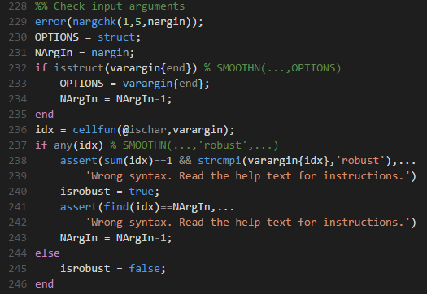
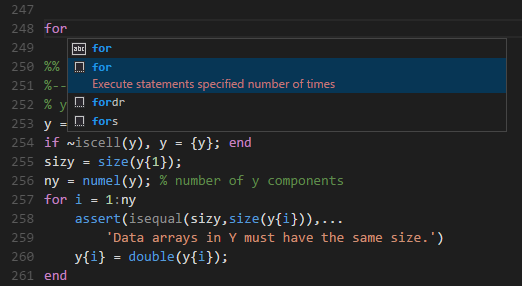
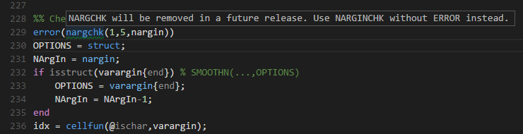

# MATLAB for Visual Studio Code

This extension adds support for MATLAB to VS Code, including:

## Colorization 

(imported from [Textmate's syntax](https://github.com/textmate/matlab.tmbundle))

## Snippets

(Translated from TextMate's snippets)

## Code Checking
Uses *mlint* for checking the MATLAB code for problems on save.

## Usage
### Install the extension in VS Code
* Open the command palette using `Ctrl+Shift+P`
* Type `ext install Matlab` in the command palette

### Select MATLAB as a language
* On the bottom-right corner, click on the *select language mode* button, if you have created a new file it should display *Plain Text*
* Select *MATLAB* in the list of languages.

Alternatively, saving the file with a `.m` extension, will allow VS Code to understand that it is a MATLAB file, and automatically select the language correctly.

### Using snippets
* Bring-up the *autocomplete* menu by hitting the `Ctrl+Shift` key combination
* Select the snippet that you want to use in the list
* Use `tab` to navigate trough the snippet's variables

### Setting-up linter
* Open the *User Settings* by going to *File*>*Preferences*>*User Settings*
* On the right pane, where you have the *settings.json* file open, add to the json file.

	`"matlab.mlintpath" : "path to your mlint.exe file"` 

	For example : 
	
	`"matlab.mlintpath": "C:\\Program Files (x86)\\MATLAB\\R2012a\\bin\\win32\\mlint.exe"`
* Save your *settings.json* file
* Now, when you open a Matlab document (*.m*), VS Code displays warnings and errors. 
  
  **Remark:** If you don't want the *lint on save* option and you want to remove the error message being displayed when the extension activates, change the `matlab.lintOnSave` option in the settings file to `False`.